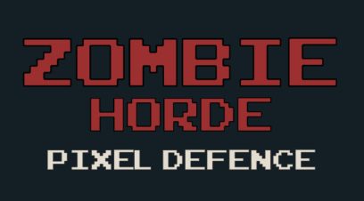
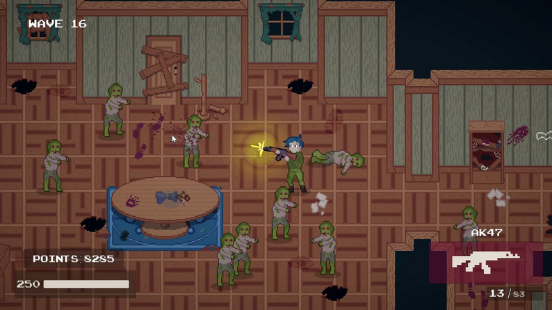
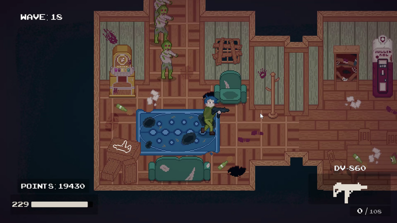

<a name="readme-top"></a>

<!-- PROJECT SHIELDS -->
<div align="center">

[](https://github.com/martijnreus/TopDownZombieShooter/pulls)
[](https://github.com/martijnreus/TopDownZombieShooter/pulls)
[](https://github.com/martijnreus/TopDownZombieShooter/issues)
[](https://github.com/martijnreus/TopDownZombieShooter/pulse/monthly)

</div>

<br/>
<div align="center">
    
</div>
<br/>

**Zombie Horde: Pixel Defence** is a Call of Duty-inspired zombie survival game where players face relentless waves of the undead in a pixel-art world. Fight zombies, earn points, unlock new areas, and discover weapons and perks to boost your chances of survival. How long can you last against the horde?

<br/>
<div align="center">
     
    &nbsp; &nbsp; &nbsp; &nbsp; &nbsp; &nbsp; &nbsp;
    
</div>
<br/>

## **Features**

- Intense wave based survival gameplay inspired by classic zombie modes.
- Points-based progression system to buy weapons and perks.
- Multiple rooms to explore, each offering new strategic advantages.
- Pixel-art visuals for a retro aesthetic.
- Designed using Unity for a seamless gaming experience.

## **Gameplay Overview**

### **Controls**

- **Keyboard/Mouse:**
- **Movement:** WASD
- **Shoot:** Left click
- **Melee:** Right click
- **Interact/Buy:** E
- **Reload:** R
- **Switch Weapon:** T
- **Pauze:** ESC

### **Objective**

Survive as long as possible by battling waves of zombies. Kill zombies to earn points, and use those points to buy weapons, unlock rooms, and collect perks. The game ends when your character is overwhelmed or gather enough points to escape.

### **Game Flow**

1. **Starting Room:** Begin in a small, room with a basic weapon.
2. **Earn Points:** Defeat zombies to earn points.
3. **Unlock Areas:** Spend points to open doors to new rooms containing better weapons and perks.
4. **Survival Challenge:** Manage resources and strategic positioning to survive increasingly difficult waves of zombies.

## **Setup and Installation**

### **Requirements**

- **Unity Version:** Unity 2021.3.19f1 or newer.
- **Platform Support:** Windows.

### **Steps to Run Locally**

1. **Clone the Repository:**
   ```bash
   git clone git@github.com:martijnreus/TopDownZombieShooter.git
   ```
2. **Open the Project in Unity:**
   - Launch Unity Hub and add the project folder.
   - Ensure you’re using the correct Unity version.
3. **Play the Game:**
   - Open the `Scenes` folder and select the main scene.
   - Press the Play button in the Unity editor.

### **Optional: Build the Game**

1. Navigate to `File > Build Settings`.
2. Choose your target platform and configure settings.
3. Click "Build and Run."

## **Repository Structure**

- **/Assets**: Game assets, scripts, prefabs, and scenes.
- **/ProjectSettings**: Unity project configuration files.
- **/Packages**: Managed dependencies.

## **Contributing**

Contributions are welcome! To contribute:

1. Fork the repository.
2. Create a feature or bugfix branch.
3. Commit your changes with clear messages.
4. Submit a pull request for review.

## **Issues and Feedback**

If you encounter bugs or have suggestions for new features, please create a ticket on the [Issues page](link-to-issues-page).

## **Acknowledgments**
- Inspired by the iconic Call of Duty zombie mode.
- DOTween asset for UI animations
- Bullet Tracer Rounds of Code Monkey